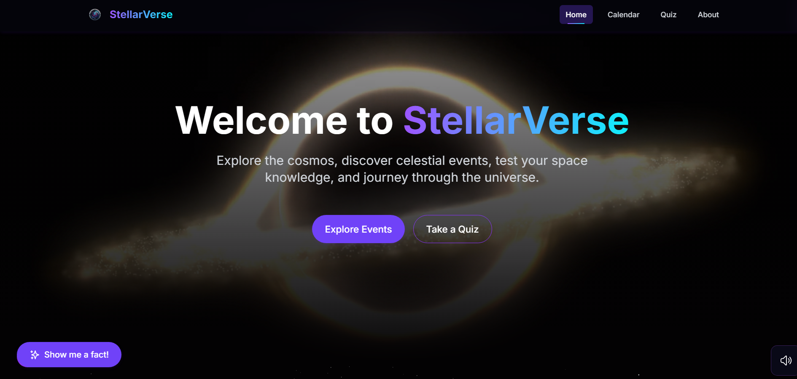

# 🌌 StellarVerse - Your Gateway to the Cosmos

StellarVerse is an immersive web application that brings the wonders of space exploration to your fingertips. Built with modern web technologies and designed for space enthusiasts, this platform offers an interactive journey through the cosmos.



🔗 [Live Demo](https://stellarverse.vercel.app/)

## ✨ Features

### 1. Interactive Space Calendar 📅
- Track celestial events and space mission dates
- Historical space events for each day
- Integration with Wikipedia's "On This Day" API
- Beautiful event cards with links to detailed information

### 2. Real-time Space Weather 🌠
- Monitor solar activity and space weather conditions
- Geomagnetic storm alerts
- Aurora visibility predictions
- Interactive weather visualization

### 3. NASA Integration 🚀
- Daily Astronomy Picture of the Day (APOD)
- High-resolution space imagery
- Detailed scientific explanations
- Full-resolution image viewing capability

### 4. Space Quiz 🎯
- Test your knowledge about space and astronomy
- Multiple difficulty levels
- Various space-related topics
- Score tracking and educational feedback

### 5. Immersive UI/UX 🎨
- Dynamic animations using Framer Motion
- Responsive design for all devices
- Space-themed visual effects
- Interactive sound effects
- Beautiful backdrop animations

## 🛠️ Installation and Setup

### Prerequisites
- Node.js (v18.0.0 or higher)
- npm (v9.0.0 or higher)
- Git

### Step 1: Clone the Repository
```bash
git clone https://github.com/Anshu10101/StellarVerse.git
cd StellarVerse
```

### Step 2: Install Dependencies
```bash
npm install
```

### Step 3: Environment Setup
Create a `.env.local` file in the root directory:
```env
# NASA API Key (Required for APOD)
NASA_API_KEY=your_nasa_api_key

# Optional: Space Weather API Key
SPACE_WEATHER_API_KEY=your_space_weather_api_key
```

### Step 4: Run Development Server
```bash
npm run dev
```

The application will be available at `http://localhost:3000`

### Step 5: Build for Production
```bash
npm run build
npm start
```

## 🔧 Tech Stack

### Core Technologies
- **Next.js 14**: React framework with server-side rendering
- **TypeScript**: For type safety and better development experience
- **Tailwind CSS**: Utility-first CSS framework
- **Framer Motion**: For smooth animations and transitions

### UI Components
- **@dotlottie/react-player**: For Lottie animations
- **@heroicons/react**: For beautiful icons
- **react-icons**: Additional icon library

### 3D and Visual Effects
- **@react-three/drei**: Three.js helpers and ready-made components
- **@react-three/fiber**: React renderer for Three.js
- **three.js**: 3D graphics library

### Development Tools
- **ESLint**: Code linting
- **PostCSS**: CSS processing
- **Autoprefixer**: CSS vendor prefixing

## 📦 Dependencies

### Production Dependencies
```json
{
  "@dotlottie/react-player": "^1.6.15",
  "@heroicons/react": "^2.1.1",
  "date-fns": "^4.1.0",
  "next": "^14.1.0",
  "react": "^18.2.0",
  "react-dom": "^18.2.0",
  "react-icons": "^4.12.0"
}
```

### Development Dependencies
```json
{
  "@react-three/drei": "^9.92.7",
  "@react-three/fiber": "^8.15.12",
  "@types/node": "^20",
  "@types/react": "^18",
  "@types/react-dom": "^18",
  "autoprefixer": "^10.0.1",
  "eslint": "^8",
  "eslint-config-next": "^14.1.0",
  "framer-motion": "^10.16.16",
  "postcss": "^8",
  "tailwindcss": "^3.3.0",
  "three": "^0.160.0",
  "typescript": "^5"
}
```

## 🌟 Unique Features

1. **Interactive Sound Design**
   - Custom sound effects for user interactions
   - Background ambient space sounds
   - Mute/unmute functionality

2. **Dynamic Visual Effects**
   - Parallax star background
   - Animated space particles
   - Smooth page transitions
   - Loading animations

3. **Responsive Design**
   - Mobile-first approach
   - Tablet and desktop optimizations
   - Touch-friendly interactions
   - Adaptive layouts

4. **Performance Optimizations**
   - Image optimization with Next.js
   - Lazy loading components
   - Code splitting
   - Progressive Web App capabilities

## 🤝 Contributing

Contributions are welcome! Please feel free to submit a Pull Request. For major changes, please open an issue first to discuss what you would like to change.

## 🙏 Acknowledgments

- NASA for their Open APIs
- Space Weather Prediction Center
- Wikipedia for historical events data
- All contributors and space enthusiasts

---
Built 💫 by Anshul Yadav for space enthusiasts everywhere
